# [AI Library](https://uche05.github.io/CI-PROJECTS-KUCJ/index.html "Click to view the deployed site")

- AI Library is a static site that shares basic knowledge about AI, Artificial Intelligence.
- The AI Library has been designed so that users at any level, who can read, write, and understand text (mainly in English), and have a drive to learn about AI, can easily comprehend its contents.
- AI Library is especially handy for those wish to learn more about AI and its history and state of the arts.
- AI Library showcases fundamental AI knowledge as well as advise to the generation where it has become more efficient.
- AI Library is the AI website for everyone. The wikified website for just for knowing about AI and it is free.
- AI Library also contains Machine Learning based knowledge.

## Table of Contents

Click here for Table of Contents

[Mock-up Screenshots](#mockup-screenshots)

[UX](#ux)

- [Colour Scheme](#colour-scheme)
- [Typography](#typography)

[User Stories](#user-stories)

- [New site Users](#new-site-users)
- [Returning Site Users](#returning-site-users)

[Wireframes](#wireframes)

- [Mobile Wireframes](#mobile-wireframes)
- [Tablet Wireframes](#tablet-wireframes)
- [Desktop Wireframes](#desktop-wireframes)

[Features](#features)

- [Existing Features](#existing-features)
- [Future Features](#future-features)

[Testing](#testing)

[Deployment](#deployment)

- [Local Deployment](#local-deployment)

  - [Cloning](#cloning)
  - [Forking](#forking)

- [Local vs Deployment](#local-vs-deployment)

[Credits](#credits)

- [Content and Code](#content-and-code)

- [Media](#media)

- [Acknowledgments](#acknowledgements)

## Mock-up Screenshots

Below are two mock-up images of the AI Library website created using the  <a href="https://ui.dev/">"Am I Responsive" website</a>.

| Screenshot 1 | Screenshot 2 |
| :---: | :---: |
|  | 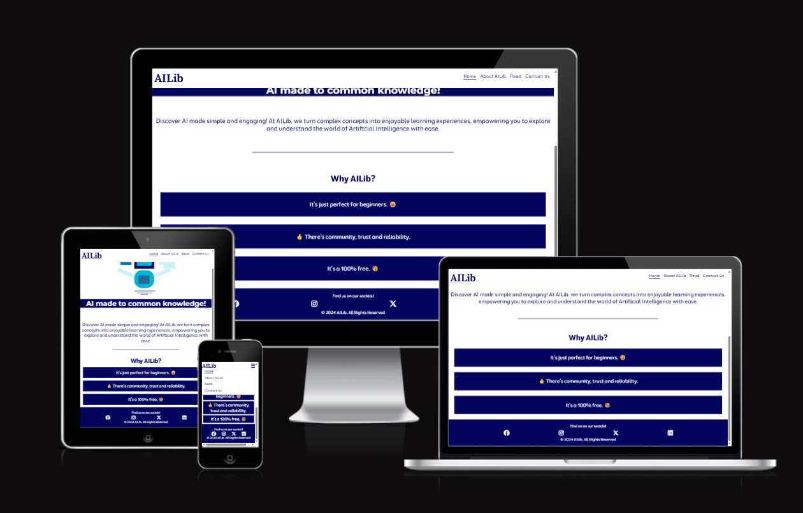 |

## UX

- The design for AI Library was created as a series of wireframes covering mobile, tablet and desktop to determine the initial design and layout of the site.
- AI Library site was designed with ease of use and simplicity in mind.
- A simple clean look was built so that all a user feels comfortable and neutral when using AILib to study.
- AILib or AI Library is meant for people who are need knowledge of AI and it's state of the arts.

### Colour Scheme

- The chosen colour scheme for AI Library is designed to be inviting and have a neutral aesthetic while giving a nice splash of colour aesthetic for color-blinded people.
- The colours used are as follows:-
- #03045e (Federal Blue)
- #0077b6
- #ffffff (white)

- I used [coolors.co](https://coolors.co/7f0ffb-c27b6f-9ecffa-fafafa-000000) to generate my colour palette initially.
- I used [coloors.contrastchecker](https://coolors.co/contrast-checker) to check the contrast between text and background colors used, ensuring readability.
- I used [colorblindor](https://www.color-blindness.com/coblis-color-blindness-simulator/) to ensure my chosen color palette is fit for color-blinded people. This feature was available in Firefox's Developer tools.

### Typography

- I used the Google Font called 'Moderustic' for the AI Library site and 'Lora' for the header.
- I felt that this font had a cool style that is easy to read and that it fitted well with the AI Library site.
- Montserrat was specifically used for the main content text. 

## Icons
- [Font Awesome](https://fontawesome.com) icons were used in the AI Library site, for GitHub links in the footer and modal and for the search icon in the main weather card.

## User Stories

### New Site Users

- As a new site user, I would like to know what the site is about, so that I understand what the site does.
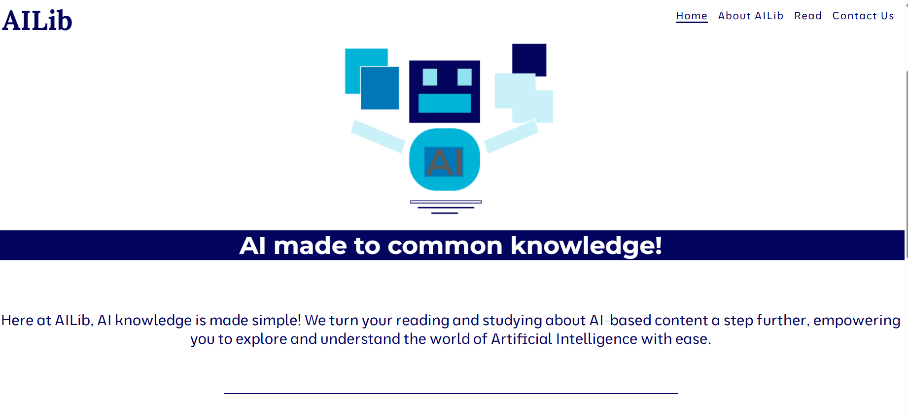
- As a new site user, I would like to easily navigate through the website intuitively.
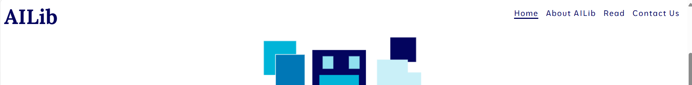
- As a new user (mobile reader), I want to browse through a timeline of articles or events, so that I can easily navigate to content based on the date or relevance.
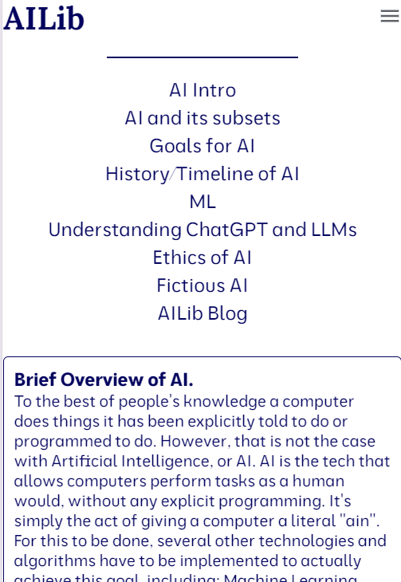
- As a new mobile user, I want to have a vertically scrollable home page that adjusts to my screen size, so that I can easily read and interact with content on my device.
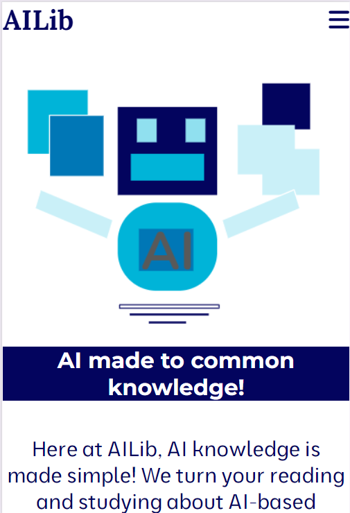
- As a new user, I want to be able to give my contact information to the site for the sake of being contacted.
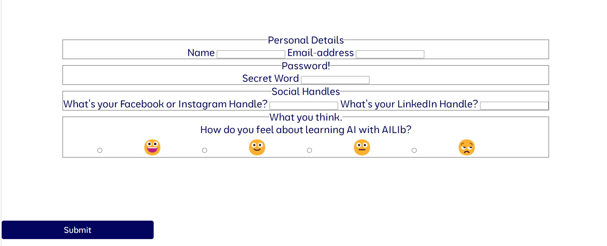
- As a new user, I would want to identify the brand on social media such as Facebook or Instagram.

- As a new user, I want to see a brief video on what AI Lib is about.

- As a new mobile user, I want to have a vertically scrollable contact form.

- As a new mobile user, I want to have a vertically scrollable timeline as it fits my screen size.

### Returning Site Users

- As a returning site user, I would like to be able to access the articles easily.

### Future Site Users

- As a future site user, I would like to explore a timeline of feature releases, so that I can see how the site has evolved over time.
- AS a future site user, I want to click on a timeline event to be taken to a detailed page with images about that update or feature,
so that I can learn more about the specific changes or improvements.

## Wireframes

I made use of Google Slides to make the wireframes of my website.

### Mobile Wireframes

| Main page |
| :---: |
| 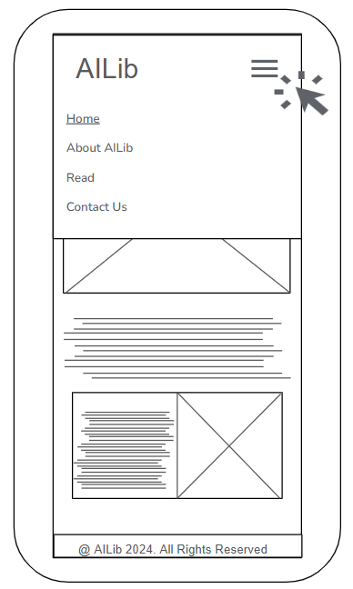 |

### Tablet Wireframes

| Main page |
| :---: |
| 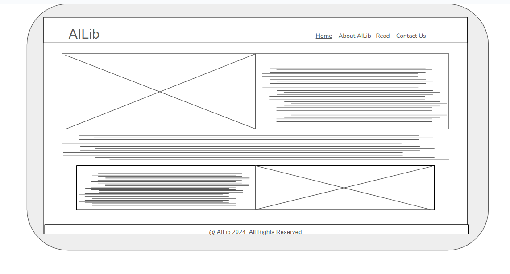 |

### Desktop Wireframes

| Main page |
| :---: |
| 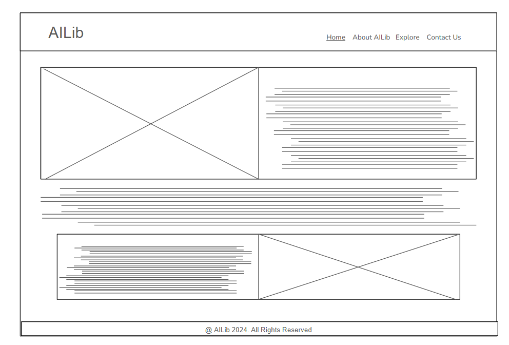 |

## Features

### Existing Features

| Feature | Description | Screenshot |
| :---: | :---: | :---: |
| **About AI Library** | The 'About AI Library' link opens a modal that gives a little information about the site. | 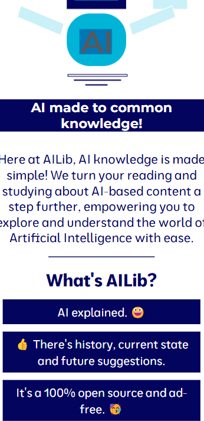 |
| **Navigation Menu of AI Lib** | The 'About AI Library Nav menu' contains links to the other webpages in the site. |  |
| **Footer** | The footer contains a link to the creators social media links. |  |
|**Read Page**| The read page contains the written content about AI and ML- based knowledge including the AI Timeline||
|**AI Timeline in Read Page**|This is the history of AI portrayed as a timeline in a section of the Read page|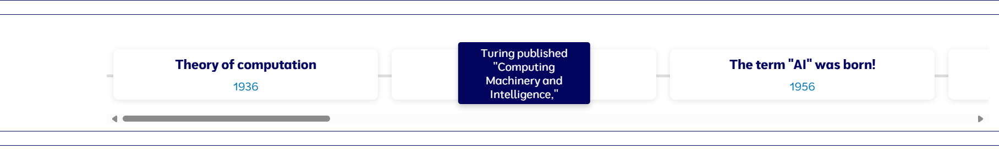|
| **Read Content Details & Summary Use** | The read section contained quite the number of details and summary elements to portary information on AI |  |
| **Roboot-like image** | The landing page color-synced image used was made by the developer himself | 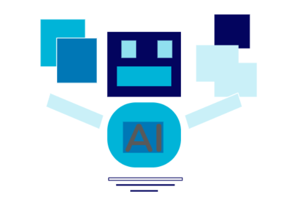 |

### Future Features

- Comment Section and Blog Post so others can contribute and or ask questions which can also be answered by other users, it will be AILib's community.
- Write the privacy notice and terms of use statements and add them to the site.
- Dark and light mode themes.
- Feedback Page to receive constructive criticsm, corrections and suggestions for my site.
- Recommendation engines and user authentication to enable actual sign-ins into the wbesite.
- Apply legal guidelines into the community of AILib (also future prospect) to avoid destructive criticsm and avoid bad/derogatory comments from users to one another.
- Change certain transitions and animations for the timeline page to make it look more attractive.

## Tools & Technologies Used

- [Am I Responsive](https://ui.dev/amiresponsive) used to make the markup screenshots to showcase in the readme file.
- [Coolors](https://coolors.co) used to check color contrasts and make interactive color pallettes.
- [Colorblindor](https://www.color-blindness.com/coblis-color-blindness-simulator/) used to see what my website would look like if I had colorblindness.
Here are screenshots to know how what they(the color-blinded) perceive.
 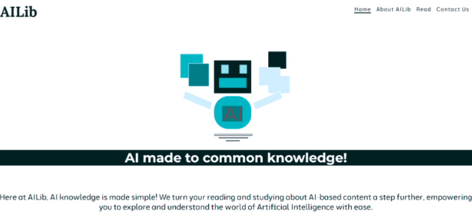
 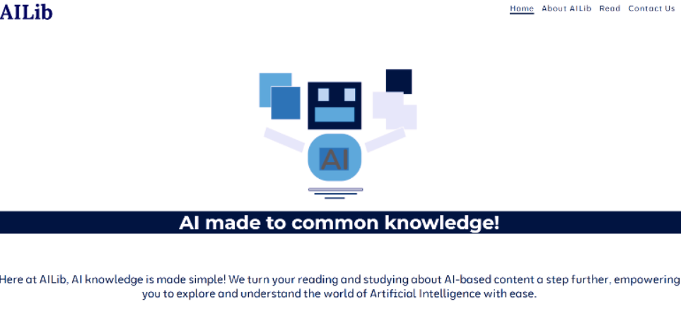
 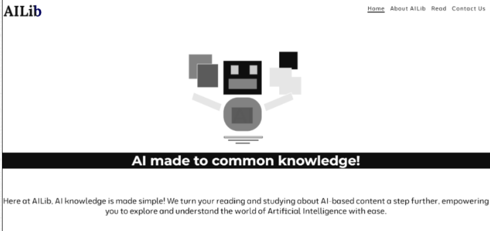
 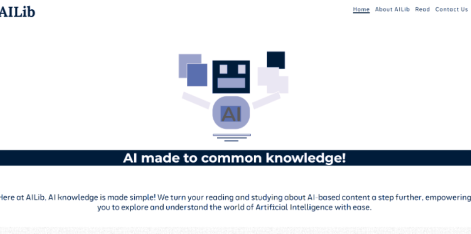
- [ChatGPT](https://chatgpt.com/) was utilized to aid me explain certain concepts on the written content from Wikipedia hence enabling me to understand and give my own report for the content of the website. It was also used as my aid in making the timeline webpage.
- [CSS Diner](https://flukeout.github.io/) used to learn many CSS selector and rule set tricks and knowledge.
- [DevTools](https://google.co.uk/chrome/) used to check regular responsivity, accessibility and overall decent previews of website before and after deployment.
- [Emojiterra](https://emojiterra.com/) used to check for emoji HTML dec values to add into my website. PS It contains different info about emojis.
- [Font Awesome](https://fontawesome.com/) used to add icons to the social media icons in the footer.
- [Git](https://git-scm.com) used for version control. (`git add`, `git commit`, `git push`)
- [GitHub](https://github.com) used for secure online code storage.
- [GitHub Pages](https://pages.github.com) used for hosting the deployed front-end site.
- [Google Slides](https://docs.google.com/presentation/) used as wireframing tool and basic image review as well as my markup/ideas panel to just keep a decent view of what I needed the site to look like.
- [Google Fonts](https://fonts.google.com/) used to search a suitable font and obtain a download link for that font.
- [Jigsaw CSS Validator](https://jigsaw.w3.org/css-validator/) used to do checks for errors on CSS elements.
- [Microsoft OneNote](https://onedrive.live.com/) used as my word processor for the written content of the site.
- [Synthesia](https://synthesia.io) used to make ai lib intro video.
- [VSCode](https://code.visualstudio.com/) used for local IDE for development. It possessed extensions which helped me immensely during my making of the site
- [W3C HTML Validator](https://validator.w3.org/) used to do checks for errors on HTML elements.
- [W3Schools](https://www.w3schools.com/graphics/svg_intro.asp) used to learn how to create an svg and actually create the favicon myself with their "Try It" Editor.
- [Wave](https://wave.webaim.org/report#/https://uche05.github.io/CI-PROJECTS-KUCJ/) used to check accessibility status of website.
- [Wikipedia](https://en.wikipedia.org/wiki/Artificial_intelligence) was the platform I used to conduct research for my written content of AILib as well as source of inspiration for most of my written topics/ concepts. Please note, I did not cold copy and paste actual written content from wikipedia to my website. I stated all actual word-by-word references on the written content where necessary.

## [Testing](TESTING.md)

## Deployment

The site was deployed to GitHub Pages. The steps to deploy are as follows:

- In the [GitHub repository](https://github.com/Uche05/ci-p1-ailib), navigate to the Settings tab.
- From the source section drop-down menu, select the **Main** Branch, then click "Save".
- The page will be automatically refreshed with a detailed ribbon display to indicate the successful deployment.

The live link can be found [here](https://uche05.github.io/ci-p1-ailib/).

### Local Deployment

This project can be cloned or forked in order to make a local copy on your own system.

#### Cloning

You can clone the repository by following these steps:

1. Go to the [GitHub repository](https://github.com/Uche05/ci-p1-ailib).
2. Locate the Code button above the list of files and click it.
3. Select if you prefer to clone using HTTPS, SSH, or GitHub CLI and click the copy button to copy the URL to your clipboard.
4. Open Git Bash or Terminal.
5. Change the current working directory to the one where you want the cloned directory.
6. In your IDE Terminal, type the following command to clone my repository:
    - `git clone https://github.com/Uche05/ci-p1-ailib.git`
7. Press Enter to create your local clone.

For Gitpod users, this was not implemented on gitpod, it was from my local PC directly to Github via git and some useful VSCode extensions.

#### Forking

By forking the GitHub Repository, we make a copy of the original repository on our GitHub account to view and/or make changes without affecting the original owner's repository.
You can fork this repository by using the following steps:

1. Log in to GitHub and locate the [GitHub Repository](https://github.com/Uche05/ci-p1-ailib).
2. At the top of the Repository (not top of page) just above the "Settings" Button on the menu, locate the "Fork" Button.
3. Once clicked, you should now have a copy of the original repository in your own GitHub account.

### Local vs Deployment

There are no notable differences between my local developed site and the GitHub pages deployed site.

## Credits

The following are credits to various people and technologies that have directly or otherwise assisted in the creation of the AI Library site.

### Content and Code

| Source | Location | Notes |
| --- | --- | --- |
|[Written Content](https://en.wikipedia.org/wiki/Artificial_intelligence)|Topics and paragraphs in read page|Most of my topic ideas/inspiration and statements originated from using Wikipedia webpage about Artifical Intelligence|
|[Written Content Source and Actual Arrangement of written content](https://onedrive.live.com/redir?resid=169491061D215030%21165&page=Edit&wd=target%28CompSciResearchToC.one%7C1473a864-1486-4c3b-b237-d074c17f2533%2F1.%20AI%20intro%7C7f209a27-06b3-450a-9cbe-e06a7cfa2fcf%2F%29&wdorigin=NavigationUrl)|Content in read page| All my written content source and actual arangement and writeup|
|[History Knowledge](https://en.wikipedia.org/wiki/Timeline_of_artificial_intelligence)|History content in read pge|Picked out/learnt the history of AI from the page to make timeline. |
|[Toogle Menu](https://uche05.github.io/CIstuff/)|Home Page- Mobile Devices|Toggle Menu Idea/Concept of using a checkbox to make menu bar instead of Javascript code trick(the Checkbox Trick) was from Love Running Project taught by Code Institute|
| [Timeline Section](https://chatgpt.com/) | Timeline section on the read page | With the help of ChatGPT I was able to make a timeline section to illustrate the history of AI in due time and in my visual idea|
|[Written content aid](https://chatgpt.com/)| Written Content Aid for Read Page| Certain topics such as Machine Learning, and understanding how LLMs work, written on the site on where also from what I learnt from ChatGPT|
|[Markdown Used](https://github.com/boderg/your-weather)|Markdown| Markdown template was from the given [github repo](https://github.com/boderg/your-weather) for the both "README" and "TESTING"|
|[Code snippets](https://uche05.github.io/CIstuff/)|Code Snippets for header, main and footer elements and certain of their children| Certain header, main and footer elements where were created from inspiration from Love Running Project taught by Code Institute.|

### Media

| Name of media | Location | Type | Notes |
| --- | --- | --- | --- |
|[Image used in home page](assets/images/ailibimgwhite.png)| Home Page | Image  |Main content image at home page|
|[Favicon](assets/images/robot.svg)| Favicon | SVG | Personally made SVG Favicon with knowledge on how from W3Schools|
|[MyGoogleSlides_Project](https://docs.google.com/presentation/d/1EJI8itIQZtTC1VfslBGDtjCnTPTPxOg0tM2cs2ZGeIs/pub?start=true&loop=false&delayms=3000)|Home page|image| Personally constructed image for the home page |
|[Wikipedia](https://en.wikipedia.org/wiki/File:Vice_President_Harris_at_the_group_photo_of_the_2023_AI_Safety_Summit.jpg) | History section of Read Page | image | AI Summit 2023 Group of Reps Image|
|[Toggle Menu](https://fontawesome.com/search?o=r&m=free)| Navigation bar at header of all pages | Icon | Toggle Hamburger Menu from Font Awesome|
|[Favicon used](assets/images/robot.svg)| Favicon and Title | Favicon | With the knowledge I earned from W3schools I made the given svg file and used it as my favicon|
|[Video Used](https://app.synthesia.io/)| About page | Video | I used synthesia.io to make a quick video about AI Lib |
|[Social media Icons Used](https://fontawesome.com/search?o=r&m=free)| Footer of all pages | Icons | I used Font Awesome to obtain the icons used for the footer |
|[Man from mce.ca](https://www.metrocontinuingeducation.ca/wp-content/uploads/2019/06/man-looking-at-computer.jpg)| About Page | image |Man Looking at computer|
|[Hephaestus Image from cdna-workstation.com](https://cdna.artstation.com/p/assets/images/images/035/422/410/large/luis-branco-hefesto.jpg?1614904348) |Read Page | Image | Image of greek god, Hephaestus used in read page content |
|[Hero of Alexandria from lookandlearn.com](https://www.lookandlearn.com/history-images/preview/M/M176/M176731_Hero-of-Alexandria-experimenting-with-steam-120-BC.jpg) | Read Page | Image | Image of hero of alexandria experimenting with a steam-based invention used in read page content|
|[Atlas 2024 Image from heavenofhorror.com](https://www.heavenofhorror.com/wp-content/uploads/2024/05/Atlas-Netflix-Review.jpg) | Read page | Image | The picture of the movie tile, Atlas  |
|[Pexels Images](https://www.pexels.com/search)| Read page | Images | Most images used in the read page are from pexels.com  |
|[Robot image from pexels.com](https://www.pexels.com/search/videos/automatons/) | Read Page | Image | Robot image used in about page content. |
|[Robot looking image from pexels.com](https://www.pexels.com/search/videos/automatons/) | Read Page  | Image | Robot image used in read page content. |
|[Image of Graph-like structure from pexels.com ](https://www.pexels.com/search/videos/automatons/) | Read Page  | Image | Graph-like structure used in read page content. |
|[Image of llms questions from pexels.com ](https://www.pexels.com/search/videos/automatons/) | Read Page  | Image | LLM question image used in read page content. |
|[Image of machine learning typewritten from pexels.com](https://www.pexels.com/search/videos/automatons/) | Read Page | Image | Machine Learning typewritten used in read page content. |
|[Image of "ChatGPT" in scrabble tiles ](https://www.pexels.com/search/videos/automatons/) | Read Page  | Image | Image of "ChatGPT" in scrabble tiles used in read page content. |

### Acknowledgements

- I would like to thank my Code Institute mentor, [Chris Quinn](https://github.com/10xOXR) for his support throughout the development of this project.
- I would like to thank [Code Institute](https://codeinstitute.net) for giving me the opportunity to complete the P1 course.
- I would like to thank the [Code Institute](https://codeinstitute.net) facilitator team [Iris Smok](https://github.com/Iris-Smok/Iris-Smok) and Irene Neville for their advice.
- I would like to thank the [Code Institute Slack community](https://code-institute-room.slack.com) for the moral support and general information that helps with my studies.
- I would like to appreciate the [W3schools website](https://www.w3schools.com/) for their free website that educates on many technological  and coding concepts intuitively and enabled me understand and learn how to craft needed stuff for my website .
- I would like to thank my family, for their support and understanding, for believing in me, and allowing me to make this transition into software development.
- I personally enjoyed performing this project as it was a chance to both construct using coding and make actual content myself through research and personal study.
