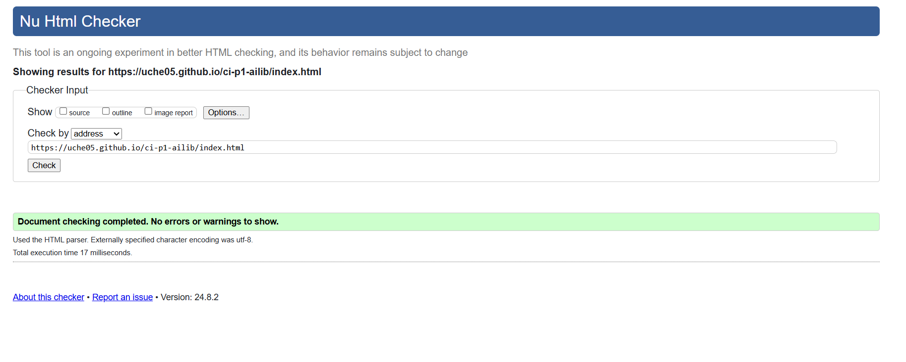
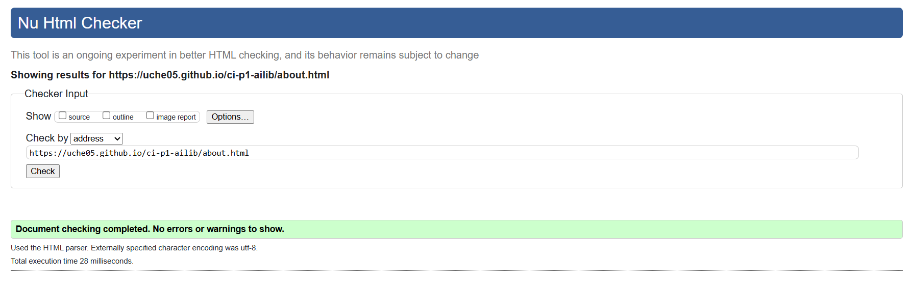
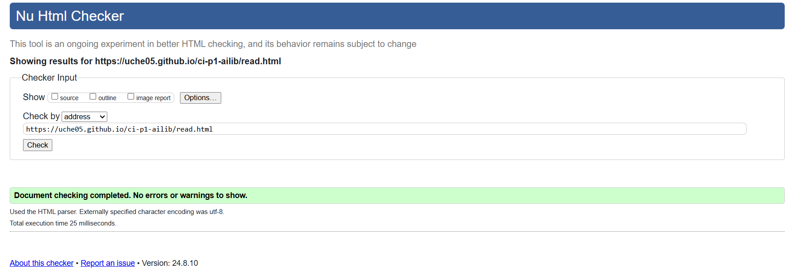
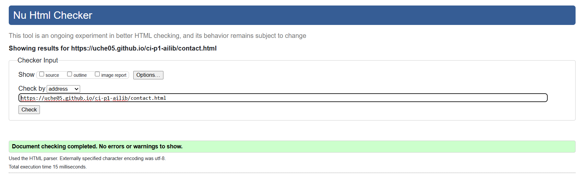
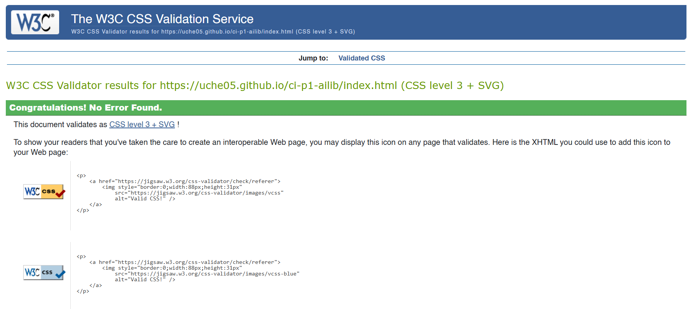
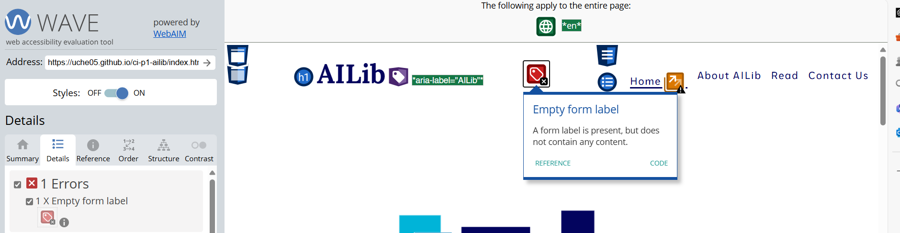
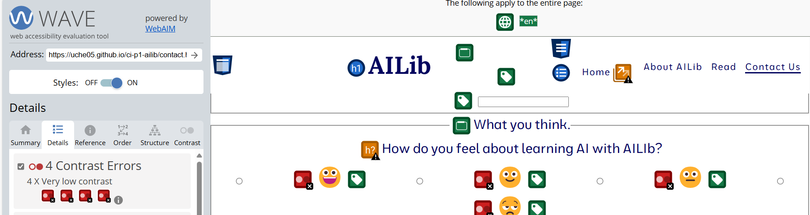

# Testing

Return back to the [README.md](README.md) file.

## Table of Contents

Click here for Table of Contents

- [Code Validation](#code-validation)
  - [HTML](#html)
  - [CSS](#css)

- [Browser Compatibility](#browser-compatibility)

- [Responsiveness](#responsiveness)

- [Accessibility](#accessibility)

- [User Story Testing](#user-story-testing)

- [Bugs](#bugs)

- [Unfixed Bugs](#unfixed-bugs)

## Code Validation

### HTML

I have used the recommended [HTML W3C Validator](https://validator.w3.org) to validate all of my HTML files.

| Landing Page | About Page | Read Page | Contact Page |
| :---: | :---: | :---: | :---: |
|||||

### CSS

I have used the recommended [CSS Jigsaw Validator](https://jigsaw.w3.org/css-validator) to validate all of my CSS files.

## Browser Compatibility

I have tested AI Library on the following browsers to check for compatibility issues.
Once the finally testing was complete no compatibility issues where found.

| Browser |
| :---: |
|Google Chrome|
|Microsoft Edge|
|Mozilla Firefox|
|Samsung Internet Browser(Andriod)|

## Responsiveness

I have tested my deployed project on multiple devices and using the developer tools to check for responsiveness issues.

Click for report

| Device |
| :---: |
|Google Pixel 4 (x2)|
|Samsung A25|
|Ipad Air(DevTools of Ms Edge, Mozilla Firefox and Google Chrome)|
|Iphone 14 Pro Max (Dev Tools of Ms Edge)|

## Accessibility

I have tested my deployed project using the [WAVE](https://wave.webaim.org/) web accessibility evaluation tool to check for any accessibility issues.

| Page | Summary | Details | Contrast | Notes |
| :---: | :---: | :---: | :---: | :---: |
| All Pages |  | 1 Error: Empty Form Label | The label used for the nav bar was considered an error but was meant to be used as nav bar for different  | An empty form label was considered an error but was necessary for the nav bar for smaller devices. |
| Contact Page |  | 4 Contrast errors | The emojis used did not have a good contrast to background | I did not change anything about it as I needed those emojis. So I added styling to the input elements to make it stand out more.|

## User Story Testing

- As a new site user, I would like to know what the site is about, so that I understand what the site does.

- As a new site user, I would like to easily navigate through the website intuitively.

- As a new user (mobile reader), I want to browse through a timeline of articles or events,
so that I can easily navigate to content based on the date or relevance.

- As a new mobile user, I want to have a vertically scrollable home page that adjusts to my screen size, so that I can easily read and interact with content on my device.

- As a new user, I want to be able to give my contact information to the site for the sake of being contacted.

- As a new user, I would want to identify the brand on social media such as Facebook or Instagram.

- As a new user, I want to see a brief video on what AI Lib is about.

- As a new mobile user, I want to have a vertically scrollable contact form.

- As a new mobile user, I want to have a vertically scrollable timeline as it fits my screen size.

### Returning Site Users

- As a returning site user, I would like to be able to access the articles easily.

## Bugs

The following are bugs that I have come across while creating the AI Lib Site.

### HTML

- Bad value for attribute id on element img as by the HTML Validator, An ID must not be the empty string.
- To resolve this, I simply removed any empty id attribute to the img element(s).

- No alt attribute in an img element.
- This was resolved as it was the image element of the navbar and I simply gave it the alternative name, "menu".

- Text inserted directly in the "details" element as by HTML Validator, Text not allowed in element details in this context.
- I simply used the paragraph element, "p" to nest all text used in the details element(s).

- Text inserted directly in the "ol" element as by HTML Validator, Text not allowed in element ol in this context. (3)
- I used appropriate list elements to subdue the naked texts.

- "br" used as child of "ol" as by HTML Validator, Element br not allowed as child of element ol in this context.
- I removed all br elements in my code.

- Certain elements were misplaced as stated by HTML Validator, "No li element in scope but a li end tag seen".
- I located such element and deleted the excesses.

- Text inserted directly into summary element, as stated by HTML Validator, "Text not allowed in element ___ in this context."
- To first fix this I made use of the p element to nest the text, however it still resulted in an error,
so I checked the W3C document recommended and used ChatGPT to provide me aid to this problem and I needed to use an inline element to wrap naked text unto
for a summary element.
I ended up using the "em" element but replaced it with the "span" element as the "em" made the 'overall look too much boldening to see'.

- Summary element at the wrong position inside the details element. This resulted in two errors thus stating,
"Element details is missing a required instance of child element summary."
,"Element summary not allowed as child of element details in this context."
- To fix this error I placed the summary element before the text rather than after.

- Used / instead of / in creating paths for file documents.
- Simply used the forward slash characher(/) to put relative file paths.

- When making a button for the contact form, I nested a button element in an "a" element.
- I simply removed the button element and styled the "a" element to look like a button instead.

- <strong>NOTE</strong>: I made use of a W3C Validator Extension to make the testing process smoothier and faster. I still used the validation website afterwards!

### CSS

- No CSS Bugs to report.

## Unfixed Bugs

There are no remaining bugs that I am aware of.
